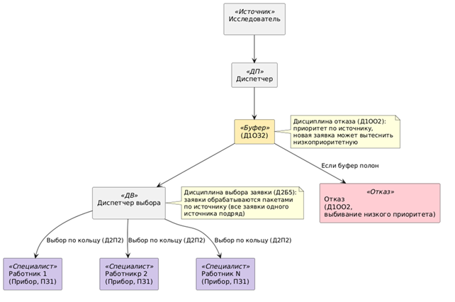
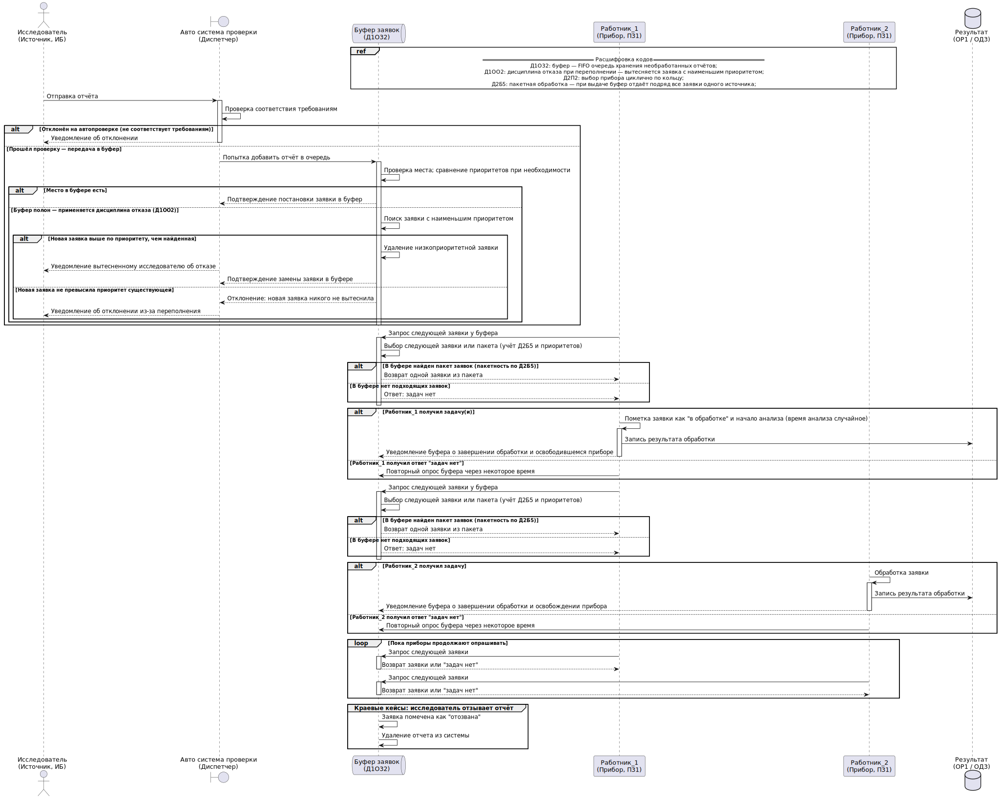
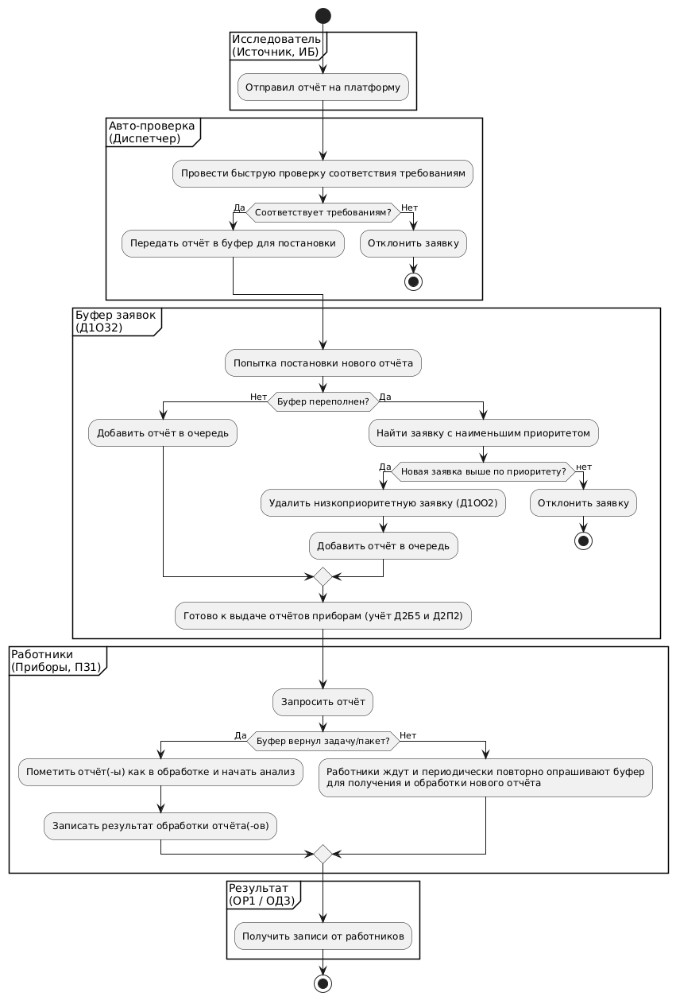

# Архитектура программных систем

### Содержание:

* [Бизнес-домен](#бизнес-домен-платформа-для-поиска-уязвимостей-за-вознаграждение-баг-баунти)
* [Элементы бизнес-домена](#элементы-бизнес-домена)
* [Схема](#схема)
* [Артефакты](#артефакты)
* [Установка и запуск](#установка-и-запуск)

## Бизнес-домен: платформа для поиска уязвимостей за вознаграждение (баг-баунти)

Рассмотрим работу платформы баг-баунти. На платформу поступают отчёты об уязвимостях от независимых исследователей.
Поток отчётов равномерный, и при высокой нагрузке невозможно сразу обработать все заявки. Автоматизированная система
распределяет их по приоритету: отчёты от исследователей с низким приоритетом могут быть вытеснены при переполнении
очереди.

Вариант № 6
|ИБ|И32|П31|Д1ОЗ2|Д1ОО2|Д2П2|Д2Б5|ОР1|ОД3|
|-|-|-|-|-|-|-|-|-|

### Элементы бизнес-домена:

1. **Источник (ИБ, ИЗ2):** Независимые исследователи безопасности отправляют отчёты на платформу. Поток отчётов
   бесконечный, распределён равномерно.
2. **Буфер (Д1ОЗ2):** Очередь хранения необработанных отчётов. Заявки ставятся в очередь в порядке поступления.
   При освобождении места заявки в буфере сдвигаются, чтобы освободить позицию для новых поступлений.
3. **Прибор (П31):** Технические специалисты, которые проверяют и классифицируют отчёты. Время анализа случайное,
   экспоненциально распределённое.
4. **Дисциплина отказа (Д1ОО2):** При переполнении буфера отчёт с наименьшим приоритетом вытесняется, чтобы освободить
   место для нового. Например, отчёты об уязвимости нулевого дня (высокий приоритет) будут обслужены раньше, чем,
   например,
   небольшие визуальные баги.
5. Дисциплины постановки на обслуживание (Д2П2, Д2Б5):
    - **Д2Б5:** Если в буфере накопились заявки от одного исследователя, система сначала обрабатывает все отчёты этого
      источника подряд. После завершения обработки пакета выбирается следующий наиболее приоритетный источник. когда все
      заявки источника будут обработаны, диспетчер перейдет к следующему по приоритету источнику;
    - **Д2П2:** Выбор технического специалиста выбирается циклично по кольцу.
6. **Заявка:** Отчёт об уязвимости, содержащий описание бага.
7. Отражение результатов (ОР1, ОД3):
    - **ОД3:** Временные диаграммы и текущее состояние системы (какие отчёты находятся в буфере, какие обрабатываются);
    - **ОР1:** Сводная таблица результатов: общее количество отчётов, количество вытесненных заявок, среднее время
      ожидания и анализа.

### Схема:

## Артефакты

### Сиквенс-диаграмма:

### Диаграмма классов:

### Flowchart:

## Установка и запуск